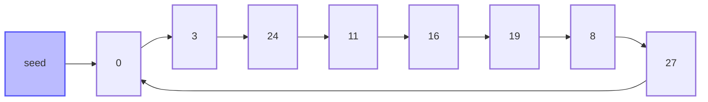

---
presentation:
  slideNumber: true
  theme: white.css
---

<!-- slide -->

# random

<!-- slide -->

# Demo

<!-- slide -->

# What is randomness?

<!-- slide -->

A _sequence_ of numbers is random when:

- there is no **pattern**
- the next outcome is not **predictable**

<!-- slide -->

@import "./images/dice-throws.png" {height="64px"}

- every outcome is equally likely
- 

<!-- slide class="left-align-list" -->

Randomness is used in many different fields:

- Simulations
- Research
- Surveys
- Gaming
- Cryptography
- ...

<!-- slide -->

# Computers and randomness

<!-- slide -->

Computers are **deterministic** machines.

Given some _inputs_, the **same** _outputs_ will be produced every single time.

<!-- slide -->

How can a computer produce randomness?

<!-- slide -->

How can a computer produce randomness?

<!-- slide -->

# What's a PRNG?

<!-- slide -->

A Pseudorandom number generator (PRNG) is a _deterministic_ algorithm which produces a sequence of numbers that _appear_ random.

<!-- slide -->

# Building our own PRNG

<!-- slide -->

**Linear Congruential Generator**

```math
X_{n+1} = (a * X_n + c) \mod m
```

- $a$ the multiplier
- $c$ the increment
- $m$ the modulus

<!-- slide -->

Using following parameters:

- $X_{0} = 0$
- $a = 7$
- $c = 3$
- $m = 2^{4}$

```math
\begin{split}
  X_1 &=(7 * 0 + 3) \mod 2^{4}\\
  &=\textcolor{#228B22}{3}
\end{split}

\newline
\newline

\begin{split}
  X_2 &=(7 * 3 + \textcolor{#228B22}{3}) \mod 2^{4}\\
  &=\textcolor{#6534AA}{24}
\end{split}

\newline
\newline

\begin{split}
  X_3 &=(7 * 3 + \textcolor{#6534AA}{24}) \mod 2^{4}\\
  &=11
\end{split}
```

---

<!-- slide -->



---

<!-- slide -->

Two important properties of a PRNG:

- it will eventually cycle back: a.k.a the **period**
- knowing the starting points, you can predict the whole sequence a.k.a the **seed**

<!-- slide -->

# Building our own PRNG

@import "./demo/builtin.iframe.html" {}

<!-- slide -->

# PRNG in the wild

| Language             | PRNG             | Period                  |
| -------------------- | ---------------- | ----------------------- |
| Java (< JDK 17 2021) | LCG              | $2^{48}$ ($~ 10^{14}$)  |
| JavaScript (v8)      | xorshift128+     | $2^{128}$ ($~ 10^{38}$) |
| Python               | Mersenne Twister | $$2^{19937} -1$$        |
| Ruby                 | Mersenne Twister | $$2^{19937} -1$$        |

<!-- slide vertical=true -->

# CloudFlare

@import "./images/lava-lamps.jpg"